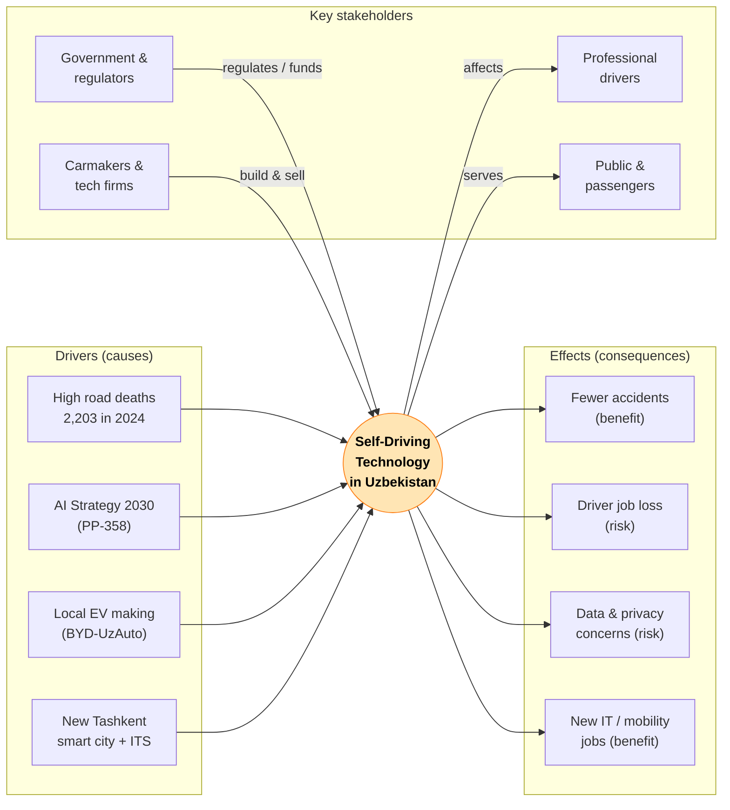

# Unit 21: Emerging Technologies — Final Assignment

**Assignment title:** Self-Driving Technologies: Impact, Adoption, and Local Context in Uzbekistan

| | |
|---|---|
| **Qualification** | Pearson BTEC Level 5 Higher Nationals in Digital Technologies |
| **Unit** | Unit 21: Emerging Technologies |
| **Student name** | _[your name]_ |
| **Group** | _[your group]_ |
| **Assessor** | Drygin Konstantin |
| **Chosen technology** | Self-driving (autonomous vehicle) technology |
| **Submission date** | _[date]_ |

---

## Task 1. Introduction (approval description)

An **emerging technology** is a new and innovative solution that is still developing, grows quickly, and has a high potential to change industries and everyday life. It is not yet a fully stable standard, but it already works in real systems today.

**Self-driving technology** fits all of these characteristics. It is *new and innovative*: it combines artificial intelligence, sensors (LiDAR, radar, cameras) and high-performance computers to let a vehicle perceive the road and drive with little or no human control, following the SAE J3016 scale from Level 0 to Level 5. It shows *fast growth*: the global autonomous-vehicle market is projected to rise from about USD 42.9 billion in 2025 to USD 122 billion by 2030 (Mordor Intelligence, 2025). It has *high impact*: it can reduce road deaths, change transport jobs and reshape city design. I chose this technology because road safety is a serious national problem in Uzbekistan and because, as a future software/IT specialist, I want to work on the AI and data systems behind intelligent mobility.

> *Word count ≈ 150. This text is also reused as the introduction and matches the mandatory "personal choice" requirement in Appendix A.*

---

## Task 2. Technology overview (three-part structured essay)

> *Structure follows Appendix B: Hook → General idea (3 theses) → each thesis with 3 arguments → conclusion → future perspective.*

### Introduction (hook + general idea)

Every working day in Tashkent, thousands of drivers sit in heavy traffic, and in 2024 alone Uzbekistan registered 9,364 road accidents that caused about 9,000 injuries and 2,203 deaths (Kursiv.media, 2025). This daily problem is exactly what self-driving technology tries to solve. **My main thesis is that self-driving technology is becoming a realistic tool to make transport safer, cheaper and more automated, even in a developing market like Uzbekistan.** To explain it, I use three theses: (1) how the technology works; (2) where it is used today; and (3) its advantages and problems.

### Thesis 1 — How the technology works

**Thesis 1:** A self-driving vehicle replaces the human driver with a loop of *sensing, thinking and acting* powered by artificial intelligence.

- **Argument 1.1 (Sensing):** The car collects data from LiDAR, radar, cameras and GPS; Yandex/Avride test vehicles, for example, use four LiDARs, six radars and 8–12 cameras to detect objects up to 500 metres away (Wikipedia, 2025).
- **Argument 1.2 (Thinking):** Deep-learning models fuse this sensor data to recognise pedestrians, cars and signs, predict their movement, and plan a safe path in real time.
- **Argument 1.3 (Acting):** Control software then sends commands to the steering, brakes and accelerator, and the SAE J3016 standard grades how much the human must still help, from Level 0 (none) to Level 5 (full automation) (SAE International, 2021).

### Thesis 2 — Where it is used today

**Thesis 2:** Self-driving features already operate in real commercial systems, from full robotaxis abroad to driver-assistance features arriving in Uzbekistan.

- **Argument 2.1 (Robotaxis):** Waymo runs paid driverless rides in the USA and has completed tens of millions of rider trips, proving Level 4 driving works in real cities (Worldmetrics, 2026).
- **Argument 2.2 (Mass-market ADAS):** BYD — which builds cars in Uzbekistan — offers its "DiPilot" intelligent driving-assistance system (DiPilot 100/300/600), bringing Level 2 features such as adaptive cruise and lane-keeping to ordinary buyers (BYD, 2025).
- **Argument 2.3 (Local context):** Ride-hailing platforms Yandex Go and Uklon already operate in Tashkent, and Uklon has begun testing **remote vehicle control** (UA.news, 2025); the new Tashkent Traffic Management Center launched in December 2025 to run an intelligent transportation system (Gazeta.uz, 2025), creating the digital base self-driving will need.

### Thesis 3 — Advantages and problems

**Thesis 3:** Self-driving technology offers strong benefits but also real risks that Uzbekistan must manage.

- **Argument 3.1 (Benefit — safety & cost):** Because most crashes are caused by human error, automation can cut accidents and lower long-term costs through fuel saving and fewer paid drivers — important where road mortality is about 45% above the EU average (UNICEF, 2026).
- **Argument 3.2 (Problem — infrastructure & cost):** The sensors and computers are expensive, and the technology needs good road markings, mapping and connectivity that are still limited outside large Uzbek cities.
- **Argument 3.3 (Problem — safety, jobs & ethics):** Software can fail in bad weather or unusual situations, raises questions of who is legally responsible in a crash, and threatens the jobs of taxi, bus and lorry drivers.

### Conclusion

- **From Thesis 1:** Self-driving cars work by sensing the road, using AI to decide, and controlling the vehicle, graded on the SAE 0–5 scale.
- **From Thesis 2:** The technology is already real — robotaxis abroad, BYD's DiPilot driver assistance, and early intelligent-transport and remote-control pilots in Tashkent.
- **From Thesis 3:** It promises safer, cheaper, automated transport, but brings cost, infrastructure, legal and employment challenges.

**Future perspective (5–10 years):** In Uzbekistan I expect a step-by-step path — first wider Level 2 driver assistance in locally assembled BYD/UzAuto cars, then automated shuttles in controlled zones such as New Tashkent or airports, rather than full Level 5 robotaxis on every street. Globally, Level 4 robotaxi services will keep expanding city by city.

---

## Task 3. Economic factors

> *400–500 word structured text following Appendix C (origin, business model, market, costs, ROI, risks, regulation/local market). 1–2 international + 2–3 Uzbekistan examples + trusted sources.*

**1. Origin and time to market.** Self-driving research began with the 1980s university projects and the U.S. DARPA Grand Challenges (2004–2007), but commercial use was delayed for almost two decades by technical limits, high sensor cost and an unready market. Only after cheaper LiDAR, GPUs and deep learning matured did Waymo launch paid driverless rides. This long gap shows the technology is capital-heavy and slow to monetise.

**2. Business model and monetisation.** The strongest model is **transport-as-a-service (robotaxi / pay-per-ride)** rather than one-time car sales, because the company keeps earning from every kilometre driven and removes the driver's wage. A second model is **selling driver-assistance software and hardware** to carmakers — for example BYD's DiPilot system bundled into its vehicles (BYD, 2025). A weak model is charging a high upfront fee for a private Level 5 car: few customers can pay, and liability is unclear, so it will not scale soon.

**3. Market size and customers.** The global autonomous-vehicle market is forecast to grow from about USD 42.9 billion in 2025 to USD 122 billion by 2030 (Mordor Intelligence, 2025), and the narrower robotaxi segment is growing even faster, from USD 0.4 billion in 2023 toward USD 45.7 billion by 2030 (MarketsandMarkets, 2024). The biggest payers are businesses and governments (fleets, logistics, cities), not individuals, because they gain most from cutting driver costs.

**4. Costs and profit.** The biggest costs are R&D, sensors and the safety validation of the AI, plus cloud computing and mapping. Unit economics only become profitable when one software stack is reused across thousands of vehicles. Until then most operators lose money per ride, which is why several global projects have closed.

**5. ROI and scalability.** Return on investment is **long-term**: software scales almost for free to millions of vehicles, but each new city needs fresh mapping and approval, so growth is regional, not instant.

**6. Risks, competition and market impact.** Risks are technical (edge-case failures), financial (huge spending before profit) and market (slow public trust). Market entry is hard because of cost and regulation, so winners are likely large platforms (Waymo, Tesla, BYD), while traditional taxi firms and professional drivers may lose. *Bridge to Task 4:* self-driving depends on and combines with AI, 5G, cloud, EV platforms and high-definition maps.

**7. Regulation and local market (Uzbekistan).** Uzbekistan is building the foundations: the **AI Development Strategy until 2030** (Presidential Resolution PP-358, 14 October 2024) targets USD 1.5 billion in AI software and services (Kursiv.media, 2024), the **BYD–UzAuto factory** in Jizzakh already produces cars with ADAS features (Gazeta.uz, 2024), and the **New Tashkent** smart-city project is designed around modern, sustainable mobility (Euronews, 2025). *Is it realistic now?* Full robotaxis are not realistic yet because of cost, infrastructure and missing road-traffic laws for autonomy, but **Level 2 assistance and pilot automated shuttles are realistic in the next 5–10 years.** *Bridge to Task 5:* these regulatory choices connect directly to the political and social factors analysed next.

> *Word count ≈ 470.*

---

## Task 4. Technology connections diagram

> *One diagram with 20–25 blocks, created in Mermaid, showing how self-driving technology
> connects to, improves and replaces other technologies (Appendix D).*
>
> **Editable source:** `diagrams/task4-technology-connections.mmd` (24 blocks).
> **Maturity classification + justification:** `diagrams/task4-maturity-table.md`.
> **To include in the PDF:** open the `.mmd` file at https://mermaid.live, export PNG/SVG,
> and paste the image below this paragraph.

**Legend.** Colours show maturity — ⚪ obsolete, 🔵 mature, 🟢 emerging, 🟠 future.
Connections show four relationship types — *needs* (dependency), *combines* (combination),
*improves* (enhancement) and *replaces* (disruption).

```mermaid
flowchart TB

    SDC["Self-Driving Vehicle System (SAE L0-L5)"]:::emerging

    LIDAR["LiDAR sensors"]:::emerging
    RADAR["Radar sensors"]:::mature
    CAM["Cameras / Computer Vision"]:::mature
    GPS["GPS / GNSS positioning"]:::mature
    IMU["IMU / wheel odometry"]:::mature
    ULTRA["Ultrasonic parking sensors"]:::mature

    AICHIP["AI accelerators / GPUs / SoC"]:::emerging
    EDGE["Edge computing"]:::emerging
    CLOUD["Cloud computing & data centres"]:::mature
    BIGDATA["Big data pipelines"]:::mature

    DL["Deep learning / neural networks"]:::emerging
    SENSORFUSION["Sensor fusion algorithms"]:::emerging
    SLAM["SLAM & path planning"]:::emerging
    HDMAP["HD maps"]:::emerging
    DT["Digital twin / simulation"]:::emerging
    V2X["V2X connectivity"]:::future

    NET5G["5G networks"]:::emerging
    OTA["OTA software updates"]:::mature
    CYBER["Automotive cybersecurity"]:::emerging
    EV["EV / electric drivetrain platform"]:::emerging
    ITS["Intelligent Transport Systems"]:::emerging

    HUMAN["Human-only driving"]:::obsolete
    PAPERMAP["Paper maps / manual navigation"]:::obsolete

    SDC --> |needs| LIDAR
    SDC --> |needs| RADAR
    SDC --> |needs| CAM
    SDC --> |needs| GPS
    SDC --> |needs| AICHIP
    SDC --> |needs| DL
    SDC --> |needs| SENSORFUSION
    SDC --> |needs| SLAM
    SDC --> |needs| HDMAP
    SENSORFUSION --> |needs| IMU
    SENSORFUSION --> |needs| ULTRA
    DL --> |needs| BIGDATA
    DL --> |needs| CLOUD
    HDMAP --> |needs| GPS

    SDC --- |combines| EV
    SDC --- |combines| V2X
    SDC --- |combines| ITS
    AICHIP --- |combines| EDGE
    V2X --- |combines| NET5G

    EDGE -.-> |improves speed| SDC
    NET5G -.-> |improves data| V2X
    DT -.-> |improves testing| DL
    OTA -.-> |improves updates| SDC
    CYBER -.-> |improves trust| SDC
    CAM -.-> |improves perception| SENSORFUSION

    SDC ==> |replaces| HUMAN
    HDMAP ==> |replaces| PAPERMAP

    classDef obsolete fill:#d9d9d9,stroke:#7f7f7f,color:#000;
    classDef mature   fill:#cfe2ff,stroke:#0d6efd,color:#000;
    classDef emerging fill:#d1e7dd,stroke:#198754,color:#000;
    classDef future   fill:#ffe5b4,stroke:#fd7e14,color:#000;
```

**Reading the diagram (matches the report).** Self-driving technology *depends on* sensors
(LiDAR, radar, cameras, GPS), AI chips and the software stack (deep learning, sensor fusion,
SLAM, HD maps). It *combines* with the EV platform, V2X and intelligent transport systems —
exactly the building blocks Uzbekistan is now putting in place (BYD–UzAuto EVs, the Tashkent
Traffic Management Center, 5G rollout). It is *improved by* edge computing, OTA updates and
cybersecurity, and it *replaces* human-only driving and paper-map navigation. This visual
confirms the Task 2/3 point that self-driving is not a single invention but a convergence of
many technologies at different maturity levels.

---

## Task 5. Political and social factors

> *400–500 word text + PEST analysis with a supporting diagram (Appendix E). At least two
> Uzbekistan examples. Weighted scoring source: `data/pest-analysis.csv`.*

Self-driving technology does not depend only on engineering; external **political, economic,
social and technological (PEST)** forces decide whether it succeeds in Uzbekistan. The PEST
method below looks only at *external* factors — things a single company cannot change.

**Political.** The government is the strongest positive force. The **AI Development Strategy
until 2030** (Presidential Resolution PP-358, 14 October 2024) makes artificial intelligence a
national priority and targets USD 1.5 billion in AI products by 2030 (Kursiv.media, 2024). In
January 2026 Uzbekistan also passed its first AI law (No. ZRU-1115), which for the first time
gives a legal definition of artificial intelligence and rules on data use (Dentons, 2026).
However, there is still **no specific road-traffic law for autonomous vehicles**, and it is
unclear who is responsible in a crash — a serious political barrier to driving on public roads.

**Economic.** Local manufacturing helps: the **BYD–UzAuto** plant in Jizzakh produces modern
vehicles with driver-assistance features (Gazeta.uz, 2024), and the **New Tashkent** smart-city
project attracts investment in the infrastructure autonomy needs (Euronews, 2025). The main
economic threat is **cost**: sensors and computers are expensive against relatively low average
incomes, so full self-driving cars are not affordable for most citizens yet.

**Social.** Society has a strong reason to want this technology: in 2024 Uzbekistan recorded
9,364 accidents and 2,203 road deaths (Kursiv.media, 2025), and road mortality is about 45%
above the EU average (UNICEF, 2026). Automation could save lives. At the same time it threatens
the jobs of taxi, bus and lorry drivers and raises **privacy** worries about constant camera and
location data. A positive social factor is that young people already trust digital mobility apps
such as Yandex Go and Uklon in Tashkent.

**Technological.** The rollout of 5G and the new **Tashkent Traffic Management Center / ITS**
(Gazeta.uz, 2025) create the connected-data base for V2X, but limited HD maps and poor road
markings outside big cities still restrict where automation can work.

### PEST weighted summary

Each factor is rated by weight **A** (general importance, all weights sum to 1.0) and strength
**B** (1–5). The score is **A × B**. Full data and the bar chart source are in
`data/pest-analysis.csv`.

| Category | Factor | A | B | A×B | +/− |
|----------|--------|---|---|-----|-----|
| **Political** | AI Strategy 2030 (PP-358) supports AI/mobility | 0.15 | 4.7 | **0.705** | 🟢 |
| **Political** | No autonomous-driving law / unclear liability | 0.12 | 4.3 | **0.516** | 🔴 |
| **Political** | AI Law ZRU-1115 (definition + data rules) | 0.06 | 3.0 | **0.180** | 🟢 |
| **Economic** | BYD–UzAuto local EV manufacturing (Jizzakh) | 0.10 | 3.7 | **0.370** | 🟢 |
| **Economic** | High cost vs low purchasing power | 0.14 | 4.5 | **0.630** | 🔴 |
| **Economic** | Investment + New Tashkent spending | 0.07 | 3.3 | **0.231** | 🟢 |
| **Social** | High accident/death rate → safety demand | 0.13 | 4.3 | **0.559** | 🟢 |
| **Social** | Public distrust + driver job loss | 0.08 | 3.7 | **0.296** | 🔴 |
| **Social** | Young population uses ride-hailing | 0.05 | 3.0 | **0.150** | 🟢 |
| **Technological** | 5G + Tashkent ITS | 0.04 | 3.3 | **0.132** | 🟢 |
| **Technological** | Limited HD maps / road markings | 0.04 | 3.7 | **0.148** | 🔴 |
| **Technological** | EV platform + charging growth | 0.02 | 2.7 | **0.054** | 🟢 |
| **TOTAL** | | **1.00** | — | **≈ 3.97** | |

**Interpretation.** The total external-pressure score is about **3.97 / 5**, which is high —
the environment strongly affects this technology. **Opportunities (≈ 2.38) outweigh threats
(≈ 1.59).** The factors to monitor most are the *AI Strategy 2030* (0.705), *high cost*
(0.630) and *road-safety demand* (0.559). The risk to fix first is the **missing autonomous-
driving law and liability rules** (0.516).

### Supporting diagram (stakeholder + cause–effect)

> **Editable source:** `diagrams/task5-pest-stakeholder.mmd`. Export an image into the PDF here.

**Bar chart (Appendix E, Step 5).** Plot each factor's **A×B** score on the Y-axis, grouped by
PEST category on the X-axis, colouring 🟢 opportunities and 🔴 threats. Build it from
`data/pest-analysis.csv` in Excel/Google Sheets and paste the chart here. It visually shows that
the AI Strategy, cost and safety-demand bars are the tallest and need the most attention.

> *Word count (analysis text) ≈ 470.*

---

## Task 6. Conclusion — future impact

> *100–150 word text with a clear personal evaluation, arguments and risks (Task 6).*

In my opinion, self-driving technology **will grow, but step by step rather than all at once**,
both globally and in Uzbekistan. The global market is forecast to nearly triple to about USD 122
billion by 2030 (Mordor Intelligence, 2025), and the strong opportunity score in my PEST analysis
(≈ 2.38 vs ≈ 1.59 threats) shows the conditions in Uzbekistan are becoming favourable: a national
AI strategy, local EV production, a new smart city, and a serious road-safety problem that
automation can help solve. The main risks are high cost, missing autonomous-driving laws,
limited infrastructure and public distrust. Therefore I expect **Level 2 driver assistance and
controlled-zone automated shuttles first**, with full robotaxis much later. As a future IT
specialist, I believe the realistic local opportunity is building the **software, data and
safety systems** behind this technology.

> *Word count ≈ 150.*
